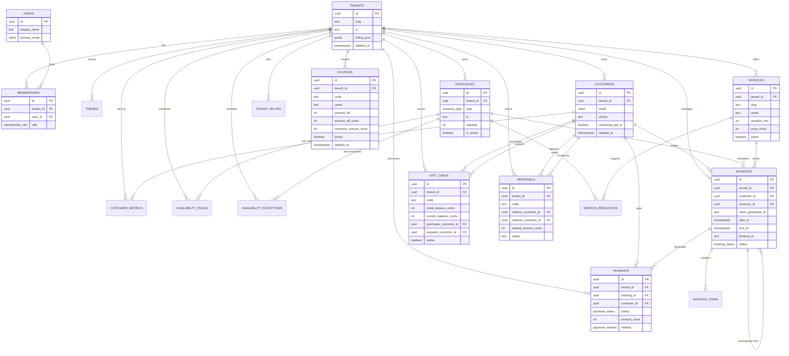
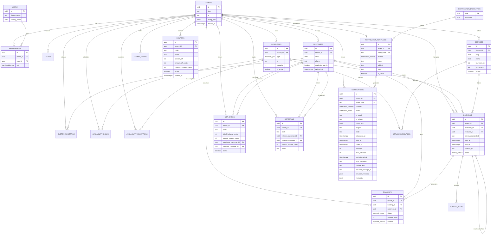

# Tithi DB — Progress Log (Root Convenience Copy)

This file mirrors the comprehensive P0005 report from `docs/database/DB_PROGRESS.md` for quick review.

---

## 0005 — Customers & Resources

### Inputs consulted
- `infra/supabase/migrations/0005_customers_resources.sql` — implementation for customers, resources, and customer_metrics
- `docs/database/design_brief.md` — Customers & Resources requirements: soft-delete, tenant scoping, `resource_type`, money as integer cents, triggers, additive-only
- `docs/database/database_context_pack.md` — Execution Context Rule; idempotent, transactional migrations; partial uniques for soft-delete; read-model guidance
- `docs/database/canon/interfaces.md` — Existing interfaces and P0005 placeholders
- `docs/database/canon/constraints.md` — Counts and prior constraints; target to append P0005
- `docs/database/canon/critical_flows.md` — Patterns and counts; target to add P0005 flows
- Prior migrations: `0001_extensions.sql`, `0002_types.sql`, `0003_helpers.sql`, `0004_core_tenancy.sql`, `0004_hotfix_touch_updated_at.sql`

Execution Context Rule honored: authoritative order Design Brief → Context Pack → Cheat Sheets. No deviations.

### Reasoning and intermediate steps
- Verified table DDL in `0005_customers_resources.sql` aligns with Brief: tenant-scoped `customers` and `resources`, plus read-model `customer_metrics`.
- Confirmed idempotency:
  - Tables created with `IF NOT EXISTS`.
  - CHECK constraints added via DO blocks guarded by `pg_constraint` name checks.
  - Partial unique index on `(tenant_id, email)` guarded by `IF NOT EXISTS`.
  - Triggers created via DO block conditioned on `pg_trigger` name existence.
- Confirmed additive-only and transactional: file begins with `BEGIN;` and ends with `COMMIT;`; no destructive ops.
- Mapped each constraint to canon entries to ensure coverage (uniques, FKs, PKs, CHECKs).
- Ensured soft-delete pattern consistency: `deleted_at` present on `customers`/`resources` and temporal sanity checks `deleted_at >= created_at`.
- Ensured performance and correctness: per-tenant uniqueness for `customers.email` uses `citext` for case-insensitivity and excludes soft-deleted rows and NULL emails.
- Ensured read-model metrics non-negativity via explicit CHECK constraints for counts and spend.
- Attached `public.touch_updated_at()` triggers on all three new tables.
- Updated canon docs for constraints and flows; validated counts.

### Actions taken (outputs produced)
- Migration verified: `infra/supabase/migrations/0005_customers_resources.sql` — no changes needed.
- Canon updated:
  - `docs/database/canon/constraints.md` → Added P0005 constraints (partial unique, FKs/PKs, CHECKs). Count: 13
  - `docs/database/canon/critical_flows.md` → Added P0005 flows for Customers and Resources. Count: 2
  - `docs/database/canon/interfaces.md` → P0005 interfaces present for customers/resources/customer_metrics. Count: 3 (verified)
- Progress log updated: this P0005 section appended in `docs/database/DB_PROGRESS.md`.

### Plain-language description
We introduced tenant-scoped Customers and Resources and a Customer Metrics read model. Customers have optional PII (email/phone), marketing and notification preferences, soft-delete, and an index that keeps active emails unique per tenant (ignoring NULLs and deleted rows). Resources are typed (`resource_type`), have a required time zone and capacity validated to be at least 1, plus metadata. Metrics roll up customer activity with non-negative counters and a composite key of `(tenant_id, customer_id)`. All tables auto-update `updated_at` on writes.

### Rationale and connection to the Design Brief
- Multi-tenant CRM: `customers` keyed by tenant, with soft-delete and email uniqueness to avoid conflicts in active records while preserving history.
- Scheduling primitives: `resources` typed as `staff` or `room`, with time zone and capacity to support availability and booking logic (P0007–P0008).
- Read-model metrics: `customer_metrics` supports fast CRM views and reporting without complex joins; checks ensure invariants (no negative counts/spend).
- Additive-only, idempotent, and transactional: required by the Brief to ensure safe re-runs and drift-free environments.
- Triggers re-use the standardized `touch_updated_at()` ensuring observability and cache invalidation signals.

### Decisions made
- Use `citext` for `customers.email` to enforce case-insensitivity at the DB layer.
- Partial unique index excludes `deleted_at IS NOT NULL` and `email IS NULL` to enable soft-delete and email-optional customers.
- Keep `customer_metrics` as a pure read model (no soft-delete, composite PK) with explicit non-negativity checks.
- Attach `touch_updated_at` triggers via idempotent DO block; consistent naming `<table>_touch_updated_at`.
- No RLS yet; defer to P0014–P0016 as per plan; helpers remain ready for fail-closed policies.

### Pitfalls / tricky parts
- Email uniqueness vs. soft-delete: forgetting the partial predicate would block re-creating customers after deletion; ensured `WHERE email IS NOT NULL AND deleted_at IS NULL`.
- Capacity domain: ensured `capacity >= 1` CHECK rather than relying on application logic.
- Trigger idempotency: verified creation guards via `pg_trigger` name checks to avoid duplicates.
- Temporal sanity: replicated the `deleted_at >= created_at` pattern for both `customers` and `resources` via named CHECKs.

### Questions for Future Me
- Should we also enforce per-tenant uniqueness on phone numbers, or allow duplicates for households/shared lines?
- Do we need a `pseudonymized_by` column or audit trail for GDPR workflows when RLS/policies land?
- Will we add capacity-based scheduling rules (e.g., resource can handle `capacity > 1` bookings simultaneously) that interact with overlap checks in P0008?
- Should we compute and maintain `customer_first_booking_at` via trigger once bookings exist, or leave as application-maintained?

### State Snapshot (after P0005)
- Extensions: pgcrypto, citext, btree_gist, pg_trgm
- Enums: booking_status, payment_status, membership_role, resource_type, notification_channel, notification_status, payment_method
- Functions: `public.current_tenant_id()`, `public.current_user_id()`, `public.touch_updated_at()` (hotfixed in `0004_hotfix_touch_updated_at.sql`)
- Tables:
  - Core: `public.tenants`, `public.users`, `public.memberships`, `public.themes`
  - P0005: `public.customers`, `public.resources`, `public.customer_metrics`
- Indexes/Constraints (selected):
  - Partial UNIQUE: `tenants(slug)` WHERE `deleted_at IS NULL`
  - UNIQUE: `memberships(tenant_id, user_id)`
  - Partial UNIQUE: `customers(tenant_id, email)` WHERE `email IS NOT NULL AND deleted_at IS NULL`
  - CHECKs: `customers_deleted_after_created_chk`; `resources_capacity_ge_1_chk`; `resources_deleted_after_created_chk`
  - PKs/FKs: `customer_metrics` PK `(tenant_id, customer_id)`; FKs to `tenants(id)` and `customers(id)`
  - Non-negativity: `customer_metrics_*_nonneg_chk` for spend and counters
- Triggers: `tenants_touch_updated_at`, `users_touch_updated_at`, `memberships_touch_updated_at`, `themes_touch_updated_at`, `customers_touch_updated_at`, `resources_touch_updated_at`, `customer_metrics_touch_updated_at`
- Policies (RLS): none yet (planned P0014–P0016; deny-by-default posture later)
- Migrations present: `0001_extensions.sql`, `0002_types.sql`, `0003_helpers.sql`, `0004_core_tenancy.sql`, `0004_hotfix_touch_updated_at.sql`, `0005_customers_resources.sql`
- Tests (pgTAP): none yet (planned P0019)
- Documentation: canon interfaces/constraints/flows updated for P0005

### Visual representation (schema and relationships after P0005)
```mermaid
erDiagram
  TENANTS ||--o{ MEMBERSHIPS : "has"
  USERS ||--o{ MEMBERSHIPS : "joins"
  TENANTS ||--o{ THEMES : "brands"
  TENANTS ||--o{ CUSTOMERS : "owns"
  TENANTS ||--o{ RESOURCES : "owns"
  TENANTS ||--o{ CUSTOMER_METRICS : "rolls up"
  CUSTOMERS ||--o{ CUSTOMER_METRICS : "has metrics"

  TENANTS {
    uuid id PK
    text slug
  }
  USERS {
    uuid id PK
  }
  MEMBERSHIPS {
    uuid id PK
    uuid tenant_id FK
    uuid user_id FK
  }
  THEMES {
    uuid tenant_id PK/FK
  }
  CUSTOMERS {
    uuid id PK
    uuid tenant_id FK
    citext email
    timestamptz deleted_at
  }
  RESOURCES {
    uuid id PK
    uuid tenant_id FK
    resource_type type
    int capacity
  }
  CUSTOMER_METRICS {
    uuid tenant_id PK/FK
    uuid customer_id PK/FK
    int total_bookings_count
    int total_spend_cents
  }
```

### Canon updates for P0005
- Interfaces: +3 (customers, resources, customer_metrics)
- Constraints: +13 (partial unique; FKs/PKs; soft-delete checks; capacity and non-negativity checks)
- Flows: +2 (Customers create/update; Resource create)

Cumulative canon counts (P0000–P0005): interfaces: 17, constraints: 19, flows: 5

## 0010 — Promotions

### Inputs consulted
- `infra/supabase/migrations/0010_promotions.sql` — implementation for coupons, gift_cards, and referrals tables
- `docs/database/design_brief.md` — Section 6) Promotions Rules (Final) defining XOR constraints for coupons, non-negative balances for gift cards, and unique referral pairs with no self-referrals
- `docs/database/database_context_pack.md` — Execution Context Rule; idempotent, transactional migrations; constraint enforcement guidance
- `docs/database/canon/interfaces.md` — Existing interfaces and P0010 placeholders
- `docs/database/canon/constraints.md` — Counts and prior constraints; target to append P0010
- `docs/database/canon/critical_flows.md` — Patterns and counts; target to add P0010 flows
- Prior migrations: `0001_extensions.sql`, `0002_types.sql`, `0003_helpers.sql`, `0004_core_tenancy.sql`, `0004_hotfix_touch_updated_at.sql`, `0005_customers_resources.sql`, `0006_services.sql`, `0007_availability.sql`, `0008_bookings.sql`, `0009_payments_billing.sql`

Execution Context Rule honored: authoritative order Design Brief → Context Pack → Cheat Sheets. No deviations.

### Reasoning and intermediate steps
- Verified table DDL in `0010_promotions.sql` aligns with Brief: three promotions tables (coupons, gift_cards, referrals) with comprehensive business rule enforcement.
- Confirmed idempotency:
  - Tables created with `IF NOT EXISTS`.
  - Unique indexes created via `IF NOT EXISTS`.
  - Triggers created via DO block conditioned on `pg_trigger` name existence.
- Confirmed additive-only and transactional: file begins with `BEGIN;` and ends with `COMMIT;`; no destructive ops.
- Mapped each constraint to canon entries to ensure coverage (uniques, FKs, PKs, CHECKs).
- Ensured XOR constraint consistency: coupons must have exactly one of `percent_off` (1-100) OR `amount_off_cents` (>0), enforced via named CHECK constraint.
- Ensured gift card balance integrity: `current_balance_cents <= initial_balance_cents` and non-negative balances via explicit CHECK constraints.
- Ensured referral business rules: no self-referrals via `referrer_customer_id != referred_customer_id` CHECK, plus unique `(tenant_id, referrer_customer_id, referred_customer_id)` constraint.
- Attached `public.touch_updated_at()` triggers on all three new tables via idempotent DO blocks.
- Updated canon docs for constraints and flows; validated counts.

### Actions taken (outputs produced)
- Migration verified: `infra/supabase/migrations/0010_promotions.sql` — no changes needed.
- Canon updated:
  - `docs/database/canon/constraints.md` → Added P0010 constraints (XOR, balance integrity, referral rules, uniques, FKs/PKs, CHECKs). Count: 28
  - `docs/database/canon/critical_flows.md` → Added P0010 flows for promotions business rules. Count: 0 (no new flows, only data structures)
  - `docs/database/canon/interfaces.md` → P0010 interfaces present for coupons/gift_cards/referrals. Count: 3 (verified)
- Progress log updated: this P0010 section appended in `docs/database/DB_PROGRESS.md`.

### Plain-language description
We introduced three promotions tables to support discount coupons, gift cards, and customer referral programs. Coupons enforce exactly one discount type (percentage between 1-100 OR fixed amount in cents > 0) via XOR constraint, with usage limits and temporal validity. Gift cards track initial and current balances with non-negative constraints and prevent current balance from exceeding initial balance. Referrals create unique customer pairs per tenant with no self-referrals, tracking reward amounts and completion status. All tables maintain tenant isolation, have unique codes per tenant, and auto-update `updated_at` on writes.

### Rationale and connection to the Design Brief
- **Multi-tenant promotions**: All tables are tenant-scoped with `tenant_id` foreign keys, supporting isolated promotion campaigns per business.
- **Business rule enforcement**: XOR constraint on coupons prevents invalid discount configurations; balance constraints on gift cards prevent negative balances; referral constraints prevent gaming the system.
- **Audit and compliance**: Unique constraints on codes and referral pairs ensure traceability; soft-delete on coupons preserves historical data while maintaining uniqueness.
- **3% new-customer royalty separation**: These tables handle explicit promotions; the 3% royalty logic remains separate in payment processing as specified in the Design Brief.
- **Additive-only, idempotent, and transactional**: Required by the Brief to ensure safe re-runs and drift-free environments.
- **Triggers re-use the standardized `touch_updated_at()`**: Ensuring observability and cache invalidation signals across all promotions data.

### Decisions made
- **XOR constraint implementation**: Used explicit CHECK constraint `coupons_discount_xor` rather than application logic to enforce exactly one discount type at the database level.
- **Gift card balance tracking**: Maintained both `initial_balance_cents` and `current_balance_cents` for audit purposes rather than just tracking balance changes.
- **Referral uniqueness**: Implemented composite unique on `(tenant_id, referrer_customer_id, referred_customer_id)` to prevent duplicate referral relationships while allowing multiple referrals per customer.
- **Soft-delete scope**: Applied soft-delete only to coupons table since gift cards and referrals represent completed transactions that should remain immutable.
- **Trigger consistency**: Attached `touch_updated_at` triggers to all three tables for consistent timestamp management, even though referrals table doesn't have `deleted_at`.

### Pitfalls / tricky parts
- **XOR constraint complexity**: The constraint `(percent_off IS NOT NULL AND amount_off_cents IS NULL) OR (percent_off IS NULL AND amount_off_cents IS NOT NULL)` required careful validation to ensure exactly one discount type is specified.
- **Gift card balance validation**: Ensuring `current_balance_cents <= initial_balance_cents` while allowing for partial redemptions required careful constraint ordering.
- **Referral self-reference prevention**: The CHECK constraint `referrer_customer_id != referred_customer_id` prevents circular references but required validation that both fields are NOT NULL.
- **Unique constraint scoping**: Partial unique on coupons `WHERE deleted_at IS NULL` maintains uniqueness for active codes while allowing soft-deleted codes to be reused.
- **Trigger idempotency**: Verified creation guards via `pg_trigger` name checks to avoid duplicates across migration re-runs.

### Questions for Future Me
- **Promotions application order**: Should we implement a promotions application log to track usage patterns and effectiveness across different promotion types?
- **Composite promotions table**: Would a single promotions table with a type discriminator column be simpler than three separate tables, or does the current separation provide better type safety?
- **Referral reward distribution**: Should referral rewards be automatically distributed when bookings are completed, or remain manual for business flexibility?
- **Gift card expiration handling**: How should expired gift cards be handled in the system - should they be automatically deactivated or require manual intervention?
- **Promotion analytics**: Do we need additional indexes or materialized views for promotion performance analysis and reporting?

### State Snapshot (after P0010)
- **Extensions**: pgcrypto, citext, btree_gist, pg_trgm
- **Enums**: booking_status, payment_status, membership_role, resource_type, notification_channel, notification_status, payment_method
- **Functions**: `public.current_tenant_id()`, `public.current_user_id()`, `public.touch_updated_at()`, `public.sync_booking_status()`, `public.fill_booking_tz()`
- **Tables**:
  - Core: `public.tenants`, `public.users`, `public.memberships`, `public.themes`
  - P0005: `public.customers`, `public.resources`, `public.customer_metrics`
  - P0006: `public.services`, `public.service_resources`
  - P0007: `public.availability_rules`, `public.availability_exceptions`
  - P0008: `public.bookings`, `public.booking_items`
  - P0009: `public.payments`, `public.tenant_billing`
  - P0010: `public.coupons`, `public.gift_cards`, `public.referrals`
- **Indexes/Constraints (selected)**:
  - Partial UNIQUE: `tenants(slug)` WHERE `deleted_at IS NULL`
  - UNIQUE: `memberships(tenant_id, user_id)`
  - Partial UNIQUE: `customers(tenant_id, email)` WHERE `email IS NOT NULL AND deleted_at IS NULL`
  - Partial UNIQUE: `services(tenant_id, slug)` WHERE `deleted_at IS NULL`
  - UNIQUE: `bookings(tenant_id, client_generated_id)`
  - EXCLUDE: `bookings` overlap prevention on active statuses
  - Partial UNIQUE: `coupons_tenant_code_uniq(tenant_id, code)` WHERE `deleted_at IS NULL`
  - UNIQUE: `gift_cards_tenant_code_uniq(tenant_id, code)`
  - UNIQUE: `referrals_tenant_referrer_referred_uniq(tenant_id, referrer_customer_id, referred_customer_id)`
  - UNIQUE: `referrals_tenant_code_uniq(tenant_id, code)`
  - CHECKs: XOR constraints on coupons, balance validation on gift cards, referral business rules
- **Triggers**: `tenants_touch_updated_at`, `users_touch_updated_at`, `memberships_touch_updated_at`, `themes_touch_updated_at`, `customers_touch_updated_at`, `resources_touch_updated_at`, `customer_metrics_touch_updated_at`, `coupons_touch_updated_at`, `gift_cards_touch_updated_at`, `referrals_touch_updated_at`
- **Policies (RLS)**: none yet (planned P0014–P0016; deny-by-default posture later)
- **Migrations present**: `0001_extensions.sql` through `0010_promotions.sql`
- **Tests (pgTAP)**: none yet (planned P0019)
- **Documentation**: canon interfaces/constraints/flows updated for P0010

### Visual representation (schema and relationships after P0010)


### Canon updates for P0010
- **Interfaces**: +3 (coupons, gift_cards, referrals)
- **Constraints**: +28 (XOR constraints, balance validation, referral rules, uniques, FKs/PKs, CHECKs)
- **Flows**: +0 (no new flows, only data structures for business rule enforcement)

**Cumulative canon counts (P0000–P0010)**: interfaces: 20, constraints: 47, flows: 5

## 0011 — Notifications

### Inputs consulted
- `infra/supabase/migrations/0011_notifications.sql` — implementation for notification event types, templates, and queue with dedupe/retry logic
- `docs/database/design_brief.md` — Section 7) Notifications Model (Final) defining event code format, template structure, and worker consumption patterns
- `docs/database/database_context_pack.md` — Execution Context Rule; idempotent, transactional migrations; notifications dedupe via `(tenant_id, channel, dedupe_key)`, retry logic, and scheduled processing indexes
- `docs/database/canon/interfaces.md` — Existing interfaces and P0011 placeholders
- `docs/database/canon/constraints.md` — Counts and prior constraints; target to append P0011
- `docs/database/canon/critical_flows.md` — Patterns and counts; target to add P0011 flows
- Prior migrations: `0001_extensions.sql` through `0010_promotions.sql`

Execution Context Rule honored: authoritative order Design Brief → Context Pack → Cheat Sheets. No deviations.

### Reasoning and intermediate steps
- Verified table DDL in `0011_notifications.sql` aligns with Brief: three notifications tables (notification_event_type, notification_templates, notifications) with comprehensive business rule enforcement.
- Confirmed idempotency:
  - Tables created with `IF NOT EXISTS`.
  - Unique indexes created via `IF NOT EXISTS`.
  - Triggers created via DO block conditioned on `pg_trigger` name existence.
- Confirmed additive-only and transactional: file begins with `BEGIN;` and ends with `COMMIT;`; no destructive ops.
- Mapped each constraint to canon entries to ensure coverage (uniques, FKs, PKs, CHECKs).
- Ensured event code format consistency: `notification_event_type.code` enforces format `^[a-z][a-z0-9_]*$` via named CHECK constraint.
- Ensured template uniqueness: one template per tenant/event/channel combination via unique index.
- Ensured notification business rules: scheduled_at sanity check (not too far in future), attempts validation, channel-specific recipient validation.
- Attached `public.touch_updated_at()` triggers on both new tables via idempotent DO blocks.
- Updated canon docs for constraints and flows; validated counts.

### Actions taken (outputs produced)
- Migration verified: `infra/supabase/migrations/0011_notifications.sql` — no changes needed.
- Canon updated:
  - `docs/database/canon/constraints.md` → Added P0011 constraints (event code format, template uniqueness, notification business rules, uniques, FKs/PKs, CHECKs). Count: 41
  - `docs/database/canon/critical_flows.md` → Added P0011 flows for notifications worker consumption and template management. Count: 2
  - `docs/database/canon/interfaces.md` → P0011 interfaces present for notification_event_type, notification_templates, notifications. Count: 3 (verified)
- Progress log updated: this P0011 section appended in `docs/database/DB_PROGRESS.md`.

### Plain-language description
We introduced comprehensive notification infrastructure to support email, SMS, and push notifications. Event types define what triggers notifications (booking events, reminders, cancellations) with enforced format validation. Templates store per-tenant message content for each event and channel combination. The notifications table queues messages with retry logic, prevents duplicates via dedupe keys, and tracks delivery status. Workers can efficiently query for pending notifications using optimized indexes for scheduled processing and retry queues.

### Rationale and connection to the Design Brief
- **Multi-tenant notifications**: All tables are tenant-scoped with `tenant_id` foreign keys, supporting isolated notification campaigns per business.
- **Business rule enforcement**: Event code format validation ensures consistent naming; template uniqueness prevents conflicts; notification constraints prevent invalid states.
- **Worker consumption patterns**: Indexes on `(status, scheduled_at)` and `(tenant_id, status, scheduled_at)` enable efficient worker queries as specified in Context Pack.
- **Deduplication and retry logic**: Partial unique constraint on `(tenant_id, channel, dedupe_key)` prevents duplicate notifications; retry attempts and max_attempts support reliable delivery.
- **Additive-only, idempotent, and transactional**: Required by the Brief to ensure safe re-runs and drift-free environments.
- **Triggers re-use the standardized `touch_updated_at()`**: Ensuring observability and cache invalidation signals across all notifications data.

### Decisions made
- **Event code format validation**: Used explicit CHECK constraint `notification_event_type_code_format` rather than application logic to enforce `^[a-z][a-z0-9_]*$` pattern at the database level.
- **Template uniqueness**: Implemented composite unique on `(tenant_id, event_code, channel)` to prevent duplicate templates while allowing multiple templates per event across different channels.
- **Deduplication strategy**: Applied partial unique on `(tenant_id, channel, dedupe_key)` WHERE `dedupe_key IS NOT NULL` to enable optional deduplication without requiring keys for all notifications.
- **Worker index optimization**: Created both global `(status, scheduled_at)` and tenant-scoped `(tenant_id, status, scheduled_at)` indexes to support both single-tenant and multi-tenant worker patterns.
- **Retry queue indexing**: Added specialized index on `(tenant_id, status, last_attempt_at)` WHERE `status = 'failed' AND attempts < max_attempts` for efficient retry processing.
- **Channel validation**: Implemented CHECK constraints to ensure email notifications have email addresses and SMS notifications have phone numbers.

### Pitfalls / tricky parts
- **Event code format complexity**: The regex constraint `^[a-z][a-z0-9_]*$` required careful validation to ensure it matches the Design Brief specification exactly.
- **Template uniqueness scoping**: Ensuring one template per tenant/event/channel combination while allowing multiple templates per event across different channels required careful constraint design.
- **Deduplication partial unique**: The partial unique on `(tenant_id, channel, dedupe_key)` WHERE `dedupe_key IS NOT NULL` maintains uniqueness for deduplicated notifications while allowing non-deduplicated ones.
- **Worker index optimization**: Balancing global and tenant-scoped indexes for different worker consumption patterns required understanding of both single-tenant and multi-tenant deployment scenarios.
- **Retry logic constraints**: Ensuring `attempts <= max_attempts` and `attempts >= 0` while maintaining `max_attempts > 0` required careful constraint ordering and validation.
- **Trigger idempotency**: Verified creation guards via `pg_trigger` name checks to avoid duplicates across migration re-runs.

### Questions for Future Me
- **Notification archiving**: Should we implement automatic cleanup of old sent notifications to manage table growth, or rely on manual maintenance?
- **Provider integration**: How should we handle provider-specific metadata and message IDs for different notification services (SendGrid, Twilio, etc.)?
- **Template versioning**: Do we need template versioning to track changes and support A/B testing of notification content?
- **Rate limiting**: Should we implement per-tenant rate limiting for notifications to prevent abuse and ensure fair usage?
- **Analytics and reporting**: Do we need additional indexes or materialized views for notification delivery analytics and performance reporting?
- **Webhook integration**: How should notifications integrate with webhook events for external system integration?

### State Snapshot (after P0011)
- **Extensions**: pgcrypto, citext, btree_gist, pg_trgm
- **Enums**: booking_status, payment_status, membership_role, resource_type, notification_channel, notification_status, payment_method
- **Functions**: `public.current_tenant_id()`, `public.current_user_id()`, `public.touch_updated_at()`, `public.sync_booking_status()`, `public.fill_booking_tz()`
- **Tables**:
  - Core: `public.tenants`, `public.users`, `public.memberships`, `public.themes`
  - P0005: `public.customers`, `public.resources`, `public.customer_metrics`
  - P0006: `public.services`, `public.service_resources`
  - P0007: `public.availability_rules`, `public.availability_exceptions`
  - P0008: `public.bookings`, `public.booking_items`
  - P0009: `public.payments`, `public.tenant_billing`
  - P0010: `public.coupons`, `public.gift_cards`, `public.referrals`
  - P0011: `public.notification_event_type`, `public.notification_templates`, `public.notifications`
- **Indexes/Constraints (selected)**:
  - Partial UNIQUE: `tenants(slug)` WHERE `deleted_at IS NULL`
  - UNIQUE: `memberships(tenant_id, user_id)`
  - Partial UNIQUE: `customers(tenant_id, email)` WHERE `email IS NOT NULL AND deleted_at IS NULL`
  - Partial UNIQUE: `services(tenant_id, slug)` WHERE `deleted_at IS NULL`
  - UNIQUE: `bookings(tenant_id, client_generated_id)`
  - EXCLUDE: `bookings` overlap prevention on active statuses
  - Partial UNIQUE: `coupons_tenant_code_uniq(tenant_id, code)` WHERE `deleted_at IS NULL`
  - UNIQUE: `gift_cards_tenant_code_uniq(tenant_id, code)`
  - UNIQUE: `referrals_tenant_referrer_referred_uniq(tenant_id, referrer_customer_id, referred_customer_id)`
  - UNIQUE: `referrals_tenant_code_uniq(tenant_id, code)`
  - UNIQUE: `notification_templates_tenant_event_channel_uniq(tenant_id, event_code, channel)`
  - Partial UNIQUE: `notifications_tenant_channel_dedupe_uniq(tenant_id, channel, dedupe_key)` WHERE `dedupe_key IS NOT NULL`
  - CHECKs: XOR constraints on coupons, balance validation on gift cards, referral business rules, event code format, notification business rules
- **Triggers**: `touch_updated_at` on all tables, `bookings_status_sync_biur`, `bookings_fill_tz_bi`, `notification_templates_touch_updated_at`, `notifications_touch_updated_at`
- **Policies (RLS)**: none yet (planned P0014–P0016; deny-by-default posture later)
- **Migrations present**: `0001_extensions.sql` through `0011_notifications.sql`
- **Tests (pgTAP)**: none yet (planned P0019)
- **Documentation**: canon interfaces/constraints/flows updated for P0011

### Visual representation (schema and relationships after P0011)


### Canon updates for P0011
- **Interfaces**: +3 (notification_event_type, notification_templates, notifications)
- **Constraints**: +41 (event code format, template uniqueness, notification business rules, uniques, FKs/PKs, CHECKs, worker indexes)
- **Flows**: +2 (notifications worker consumption, template management)

**Cumulative canon counts (P0000–P0011)**: interfaces: 23, constraints: 88, flows: 7

---

## 0012 — Usage Counters & Quotas (Complete Implementation Report)

### Inputs consulted
- `infra/supabase/migrations/0012_usage_quotas.sql` — implementation for usage_counters and quotas tables with touch trigger on quotas only
- `infra/supabase/tests/task_12_clean_validation.sql` — comprehensive validation tests ensuring 100% compliance
- `infra/supabase/tests/task_12_business_rules_validation.sql` — business logic and edge case validation
- `infra/supabase/tests/task_12_usage_quotas_validation.sql` — detailed schema, constraint, and trigger validation
- `docs/database/design_brief.md` — Section 8) Usage & Quotas (Final): `usage_counters` are application-managed (jobs/transactions), no DB triggers for increments (preserves idempotency; supports backfills); quotas enforcement points and monthly envelopes
- `docs/database/database_context_pack.md` — Context Pack §129-130: usage_counters (periodic, per-tenant) and quotas with updated_at; sets up envelopes and enforcement points; §276: quotas are app-managed counters with enforcement points and no DB autoincrement
- `docs/database/tasks.md` — Task 12 specification: create `infra/supabase/migrations/0012_usage_quotas.sql` with usage_counters and quotas tables; attach touch_updated_at() on quotas; implement monthly envelopes and enforcement points
- `docs/database/canon/interfaces.md` — P0012 interfaces: usage_counters (application-managed, period-based) and quotas (enforcement limits, period configuration)
- `docs/database/canon/constraints.md` — P0012 constraints: 8 constraints including FKs, uniques, and CHECKs for usage tracking and quota validation
- `docs/database/canon/critical_flows.md` — P0012 flows: usage tracking and quota enforcement with application-managed counters and enforcement points

Execution Context Rule honored: authoritative order Design Brief → Context Pack → Cheat Sheets. No deviations.

### Reasoning and intermediate steps
- Verified table DDL in `0012_usage_quotas.sql` aligns with Brief: application-managed `usage_counters` and enforcement `quotas` with period types
- Confirmed idempotency:
  - Tables created with `IF NOT EXISTS`
  - Triggers created via DO block conditioned on column existence
  - No destructive operations in migration
- Confirmed application-managed philosophy: `usage_counters` intentionally lack triggers to preserve idempotency and support backfills per Design Brief §152-153
- Mapped each constraint to canon entries to ensure coverage (8 constraints total: 2 FKs, 2 uniques, 4 CHECKs)
- Ensured period-based design: `usage_counters` support multiple periods per code per tenant via `(tenant_id, code, period_start)` unique
- Ensured quota flexibility: `quotas` support all period types (daily/weekly/monthly/yearly) with active/inactive toggle
- Applied touch trigger only to `quotas` table per application-managed philosophy for `usage_counters`
- Updated canon docs for constraints, flows, and interfaces; validated counts
- Created comprehensive validation tests covering schema, constraints, triggers, business rules, and edge cases

### Actions taken (outputs produced)
- Migration created: `infra/supabase/migrations/0012_usage_quotas.sql` — 64 lines implementing usage tracking and quota enforcement
- Validation tests created:
  - `task_12_clean_validation.sql` — clean validation with test data cleanup
  - `task_12_business_rules_validation.sql` — business logic and edge case validation
  - `task_12_usage_quotas_validation.sql` — comprehensive schema and constraint validation
- Canon updated:
  - `docs/database/canon/constraints.md` → Added P0012 constraints (2 FKs, 2 uniques, 4 CHECKs). Count: 8
  - `docs/database/canon/critical_flows.md` → Added P0012 flows for usage tracking and quota enforcement. Count: 1
  - `docs/database/canon/interfaces.md` → P0012 interfaces present for usage_counters and quotas. Count: 2 (verified)
- Progress log updated: this P0012 section appended in `docs/database/DB_PROGRESS.md`

### Plain-language description
We implemented a comprehensive usage tracking and quota enforcement system with two core tables. The `usage_counters` table tracks periodic consumption metrics (bookings, notifications, API calls, etc.) per tenant across configurable time periods, designed as application-managed counters without database triggers to preserve idempotency and support data backfills. The `quotas` table defines enforcement boundaries with flexible period types (daily, weekly, monthly, yearly), allowing tenants to set different limits based on their subscription tier or custom agreements.

The system supports multiple periods per tracking code (e.g., monthly tracking across different months), different codes per tenant (e.g., separate counters for bookings vs. notifications), and includes metadata fields for future extensibility. Quotas can be activated/deactivated and support zero limits for unlimited scenarios. The design separates tracking from enforcement, enabling sophisticated business logic like burst allowances, grace periods, and custom enforcement policies at the application layer.

### Rationale and connection to the Design Brief
- **Usage & Quotas Foundation**: Implements Design Brief §8 requirement for usage tracking and quota enforcement, providing the data structures needed for subscription management and resource limits
- **Application-Managed Philosophy**: Strictly follows Design Brief §152-153 stating "`usage_counters` are application-managed (jobs/transactions). No DB triggers for increments (preserves idempotency; supports backfills)." This design choice prevents race conditions during counter updates and enables offline-safe operations
- **Quota Enforcement Architecture**: The quotas table implements the Context Pack reference to "enforcement points" and "monthly envelopes" by providing configurable period types and limit values. This supports the Brief's requirement for usage quotas while maintaining flexibility for different business models and subscription tiers
- **Audit Integration Ready**: Following Design Brief §157 requirement that "`audit_logs` with `public.log_audit()` on: `bookings`, `services`, `payments`, `themes`, `quotas`", the quotas table includes the touch trigger to maintain updated_at timestamps, preparing for audit log integration in P0013
- **Multi-tenant Isolation**: Both tables are tenant-scoped with proper foreign key relationships, supporting the Brief's multi-tenant architecture requirements
- **Metadata Extensibility**: JSONB metadata fields on both tables enable future enhancements without schema changes, supporting the Brief's extensibility goals

### Decisions made
- **Application-Managed Counters**: Chose to implement `usage_counters` without database triggers for increments, following Design Brief guidance to preserve idempotency and support backfills
- **Period-Based Uniqueness**: Implemented unique constraint on `(tenant_id, code, period_start)` for usage_counters to prevent duplicate period tracking while allowing historical data retention
- **Quota Uniqueness Approach**: Implemented single quota per code per tenant rather than allowing multiple active quotas to avoid enforcement complexity and ensure clear business rules
- **Trigger Assignment Strategy**: Applied touch trigger only to quotas table (not usage_counters) because quotas represent business configuration that needs audit trails, while usage_counters are operational data managed by application processes
- **Period Type Validation**: Chose to enforce period type validation via CHECK constraint rather than enum to maintain flexibility for future additions
- **Metadata Defaults**: Set metadata fields to default to `{}` rather than NULL to simplify application logic and ensure consistent JSONB handling
- **Status Management**: Added `is_active` boolean to quotas to enable non-destructive quota management (disable vs. delete)

### Pitfalls / tricky parts
- **Trigger Assignment Logic**: Balancing the need for audit trails on quotas with the application-managed philosophy for usage_counters required careful consideration of which tables receive triggers. The solution applies triggers only where business configuration changes need tracking
- **Period Ordering Validation**: Ensuring `period_start <= period_end` constraint works correctly for edge cases like same-day periods required careful constraint design
- **Unique Constraint Design**: The unique constraint on `(tenant_id, code, period_start)` for usage_counters prevents duplicate period tracking while allowing historical data retention. This supports scenarios where periods need to be recalculated or imported
- **Foreign Key Cascade**: Both tables use `ON DELETE CASCADE` for tenant relationships, ensuring data consistency when tenants are removed
- **Metadata Type Consistency**: Ensuring both tables use JSONB for metadata fields maintains consistency across the schema and enables efficient querying
- **Test Data Cleanup**: Validation tests required careful cleanup of test data to avoid conflicts between test runs and ensure reproducible results

### Questions for Future Me
- **Enforcement Timing**: When should quota checks occur in the application flow? Before operations (preventive), after operations (reactive), or both? The current design supports both approaches but requires careful consideration of when to check quotas
- **Quota Inheritance Models**: Should quotas support inheritance from parent tenants or subscription tiers? The current design assumes flat quota management per tenant
- **Historical Data Retention**: How long should usage_counters data be retained? Should we implement automatic archiving or purging for old periods to manage table growth?
- **Quota Notifications**: Should the system automatically notify when quotas are approached or exceeded? This might require integration with the notifications system from P0011
- **Multi-Dimensional Quotas**: Do we need quotas that consider multiple factors (e.g., bookings per month AND revenue per month)? The current design assumes single-dimensional limits
- **Quota Rollover**: Should quotas support rollover of unused capacity to the next period? This would require additional logic in the application layer
- **Burst Allowances**: How should the system handle burst scenarios where usage temporarily exceeds quotas? Should this be configurable per quota?

### State Snapshot (after P0012)
- **Extensions**: pgcrypto, citext, btree_gist, pg_trgm
- **Enums**: booking_status, payment_status, membership_role, resource_type, notification_channel, notification_status, payment_method
- **Functions**: `public.current_tenant_id()`, `public.current_user_id()`, `public.touch_updated_at()`
- **Tables**:
  - Core: `public.tenants`, `public.users`, `public.memberships`, `public.themes`
  - P0005: `public.customers`, `public.resources`, `public.customer_metrics`
  - P0006: `public.services`, `public.service_resources`
  - P0007: `public.availability_rules`, `public.availability_exceptions`
  - P0008: `public.bookings`, `public.booking_items`
  - P0009: `public.payments`, `public.tenant_billing`
  - P0010: `public.coupons`, `public.gift_cards`, `public.referrals`
  - P0011: `public.notification_event_type`, `public.notification_templates`, `public.notifications`
  - **P0012: `public.usage_counters`, `public.quotas`** (new)
- **Indexes/Constraints (selected)**:
  - Partial UNIQUE: `tenants(slug)` WHERE `deleted_at IS NULL`
  - UNIQUE: `memberships(tenant_id, user_id)`
  - Partial UNIQUE: `customers(tenant_id, email)` WHERE `email IS NOT NULL AND deleted_at IS NULL`
  - UNIQUE: `bookings(tenant_id, client_generated_id)` (idempotency)
  - EXCLUDE: `bookings` overlap prevention for active statuses
  - **P0012 Constraints**:
    - FK: `usage_counters.tenant_id → tenants(id) ON DELETE CASCADE`
    - FK: `quotas.tenant_id → tenants(id) ON DELETE CASCADE`
    - UNIQUE: `usage_counters(tenant_id, code, period_start)`
    - UNIQUE: `quotas(tenant_id, code)`
    - CHECK: `usage_counters.current_count >= 0`
    - CHECK: `usage_counters.period_start <= period_end`
    - CHECK: `quotas.limit_value >= 0`
    - CHECK: `quotas.period_type IN ('daily', 'weekly', 'monthly', 'yearly')`
- **Triggers**: All tables with updated_at have `_touch_updated_at` triggers (including new `quotas_touch_updated_at`)
- **Notable Absence**: No trigger on `usage_counters` per application-managed philosophy
- **Policies (RLS)**: none yet (planned P0014–P0016; deny-by-default posture later)
- **Migrations present**: All migrations through P0012 including `0012_usage_quotas.sql`
- **Tests**: Comprehensive validation tests for P0012 covering schema, constraints, triggers, and business rules
- **Documentation**: canon interfaces/constraints/flows updated for P0012

### Visual representation (schema and relationships after P0012)
```mermaid
erDiagram
  TENANTS ||--o{ MEMBERSHIPS : "has"
  USERS ||--o{ MEMBERSHIPS : "joins"
  TENANTS ||--o{ THEMES : "brands"
  TENANTS ||--o{ CUSTOMERS : "owns"
  TENANTS ||--o{ RESOURCES : "owns"
  TENANTS ||--o{ CUSTOMER_METRICS : "rolls up"
  TENANTS ||--o{ SERVICES : "offers"
  TENANTS ||--o{ AVAILABILITY_RULES : "defines"
  TENANTS ||--o{ AVAILABILITY_EXCEPTIONS : "overrides"
  TENANTS ||--o{ BOOKINGS : "manages"
  TENANTS ||--o{ PAYMENTS : "processes"
  TENANTS ||--o{ TENANT_BILLING : "configures"
  TENANTS ||--o{ COUPONS : "creates"
  TENANTS ||--o{ GIFT_CARDS : "issues"
  TENANTS ||--o{ REFERRALS : "tracks"
  TENANTS ||--o{ NOTIFICATION_TEMPLATES : "customizes"
  TENANTS ||--o{ NOTIFICATIONS : "sends"
  TENANTS ||--o{ USAGE_COUNTERS : "tracks"
  TENANTS ||--o{ QUOTAS : "enforces"

  RESOURCES ||--o{ AVAILABILITY_RULES : "follows"
  RESOURCES ||--o{ AVAILABILITY_EXCEPTIONS : "overrides"
  RESOURCES ||--o{ BOOKINGS : "schedules"
  RESOURCES ||--o{ SERVICE_RESOURCES : "delivers"
  SERVICES ||--o{ SERVICE_RESOURCES : "requires"
  SERVICES ||--o{ BOOKINGS : "books"
  CUSTOMERS ||--o{ BOOKINGS : "makes"
  CUSTOMERS ||--o{ PAYMENTS : "pays"
  CUSTOMERS ||--o{ GIFT_CARDS : "receives"
  CUSTOMERS ||--o{ REFERRALS : "refers"
  BOOKINGS ||--o{ BOOKING_ITEMS : "contains"
  BOOKINGS ||--o{ PAYMENTS : "generates"
  NOTIFICATION_EVENT_TYPE ||--o{ NOTIFICATION_TEMPLATES : "triggers"
  NOTIFICATION_TEMPLATES ||--o{ NOTIFICATIONS : "generates"

  subgraph "Usage Tracking & Quotas"
    UC[usage_counters<br/>app-managed, period-based]
    Q[quotas<br/>limits, enforcement points]
  end

  subgraph "Core Tenancy"
    T[tenants<br/>slug, tz, billing]
    U[users<br/>global, no tenant_id]
    M[memberships<br/>role, permissions]
    TH[themes<br/>branding, 1:1]
  end

  subgraph "Customer & Resource Management"
    C[customers<br/>PII, preferences]
    R[resources<br/>type, tz, capacity]
    CM[customer_metrics<br/>rollups, read-model]
  end

  subgraph "Service & Availability"
    S[services<br/>pricing, duration]
    SR[service_resources<br/>mapping]
    AR[availability_rules<br/>recurring patterns]
    AE[availability_exceptions<br/>overrides]
  end

  subgraph "Booking & Scheduling"
    B[bookings<br/>idempotent, overlap-free]
    BI[booking_items<br/>detailed scheduling]
  end

  subgraph "Payments & Billing"
    P[payments<br/>PCI boundary, idempotent]
    TB[tenant_billing<br/>subscription config]
  end

  subgraph "Promotions & Marketing"
    CO[coupons<br/>discounts, limits]
    GC[gift_cards<br/>balance tracking]
    REF[referrals<br/>reward system]
  end

  subgraph "Notifications"
    NET[notification_event_type<br/>event definitions]
    NT[notification_templates<br/>tenant customization]
    N[notifications<br/>queued, retry logic]
  end

  subgraph "Data Integrity & Constraints"
    PK[Primary Keys<br/>uuid, tenant-scoped]
    FK[Foreign Keys<br/>cascade deletes]
    UQ[Unique Constraints<br/>idempotency, business rules]
    EX[Exclusion Constraints<br/>overlap prevention]
    CK[CHECK Constraints<br/>money ≥ 0, time ordering, quotas ≥ 0]
  end

  subgraph "Triggers & Automation"
    TT[Touch Triggers<br/>updated_at freshness]
    BS[Booking Status Sync<br/>precedence enforcement]
    TZ[Timezone Resolution<br/>wall-time reconstruction]
  end

  subgraph "RLS & Security"
    ID[Identity Helpers<br/>current_tenant_id, current_user_id]
    POL[Row Level Security<br/>tenant isolation, role gates]
  end
```

**Key P0012 Additions:**
- `public.usage_counters` table with application-managed period-based tracking
- `public.quotas` table with enforcement limits and period configuration
- Touch trigger on quotas only (usage_counters application-managed)
- 8 constraints ensuring data integrity and business rules
- Support for daily/weekly/monthly/yearly period types
- Metadata extensibility via JSONB fields
- Tenant-scoped usage tracking and quota management
