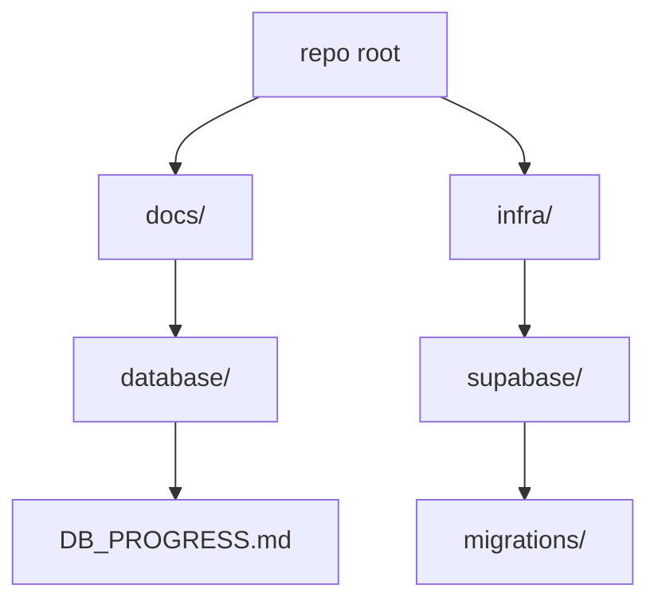
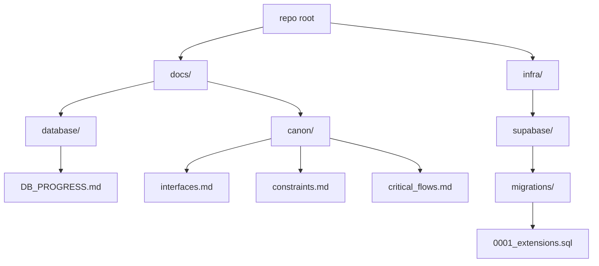
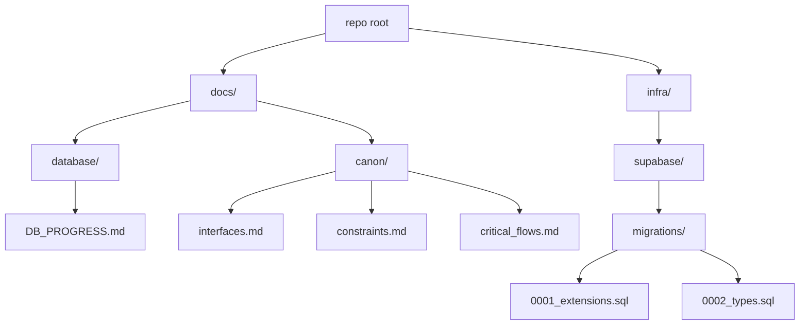

# Tithi DB — Progress Log

## How to read this
- This document is the single source of truth for database work across prompts P0000 → P0019.
- Each section records the full context: inputs reviewed, reasoning, intermediate steps, decisions, outputs, and the database state snapshot after the step.
- We strictly follow the Execution Context Rule: align with Design Brief > Context Pack > Cheat Sheets.
- After each prompt, we include “Canon updates” counts to help CI verify coverage.
- Read newest section last; earlier sections remain immutable records.

---

## Execution Context Rule (acknowledged for P0000)
We loaded and aligned with all three canonical sources before making changes:
- Design Brief: `docs/database/design_brief.md`
- Context Pack: `docs/database/database_context_pack.md`
- Cheat Sheets: `docs/database/cheat sheets/interfaces.md`, `docs/database/cheat sheets/constraints.md`, `docs/database/cheat sheets/critical_flows.md`

Priority of resolution: Design Brief → Context Pack → Cheat Sheets. Fail-safe posture: if an invariant would be broken, halt and surface the violation.

---

## P0000 — Initialize DB folder + progress doc (no SQL)

### Inputs consulted
- `docs/database/tasks.md` — Task 00 specification: create `infra/supabase/migrations/`, create root `docs/`, and create `docs/DB_PROGRESS.md` with a title and short “How to read this”; output one fenced block with full contents of `docs/DB_PROGRESS.md`.
- `docs/database/design_brief.md` — Final authoritative schema and rules, including RLS everywhere, path-slug tenancy, enumerations, constraints, triggers, and acceptance criteria. No domains table pre-0019. CI expectations include references to the Execution Context Rule and canon counts.
- `docs/database/database_context_pack.md` — Guardrails, invariants, prompt-by-prompt outcomes, and Canon Appends coverage guidance. Emphasizes additive-only changes, transactions, RLS deny-by-default, and documentation rigor.
- Cheat Sheets (currently empty placeholders):
  - `docs/database/cheat sheets/interfaces.md`
  - `docs/database/cheat sheets/constraints.md`
  - `docs/database/cheat sheets/critical_flows.md`

### Reasoning and intermediate steps
- Verified existing repository structure to avoid collisions with any existing progress files; we retain `docs/database/DB_PROGRESS.md` as the canonical progress log.
- Created `infra/supabase/migrations/` to establish the canonical path for migrations 0001 → 0019.
- Composed this self-contained progress log to satisfy both Task 00 and the extended reporting requirements (complete record of inputs, reasoning, outputs, and a state snapshot).
- Included an explicit mention of the Execution Context Rule and canon counts to align with CI expectations described in the Design Brief and Context Pack.

### Actions taken (outputs produced)
- Created folder: `infra/supabase/migrations/` (with a `.gitkeep` for VCS visibility).
- Created/updated file: `docs/database/DB_PROGRESS.md` (this document).

### Plain-language description
We set up the base folders for database migrations and wrote this progress log. No SQL or schema was created in this step. This file explains how future steps will be documented and verified.

### Rationale and connection to the Design Brief
- The Design Brief and Context Pack define a rigorous, stepwise path (P0000 → P0019). Task 00 creates the scaffolding and a durable audit of decisions so every subsequent migration and policy change is traceable.
- Documenting the Execution Context Rule and canon counts now ensures CI/reviewers can enforce alignment from the very first step.

### Decisions made
- Keep existing `docs/database/DB_PROGRESS.md` untouched; introduce canonical root `docs/DB_PROGRESS.md` per Task 00.
- Add `.gitkeep` to `infra/supabase/migrations/` to ensure the folder is tracked before SQL is added.
- Record canon counts for P0000 as zeroes (no interfaces/constraints/flows are introduced in this step).

### Pitfalls / tricky parts
- Avoid producing any SQL or out-of-scope files during initialization.
- Ensure we output exactly one fenced block in PR/chats for Task 00 when requested, matching the instruction in `tasks.md`.
- Maintain the additive-only rule from the outset: scaffolding should not preclude later additive evolutions.

### Questions for Future Me
- Do we want to add a dedicated `docs/canon/` directory in a later step (as required by P0001+ prompts) to store per-prompt canon append sections? Likely yes, starting at P0001 when those outputs first appear.
- Should we add a short “CI signals” subsection to each future section to track expected presence of Execution Context Rule mention and canon counts? This document already includes both for P0000; we can continue the pattern.

### State Snapshot (after P0000)
- Tables: none created
- Enums: none created
- Functions: none
- Triggers: none
- Policies (RLS): none (RLS will be enabled from P0014 onward per plan)
- Indexes: none
- Migrations folder: present at `infra/supabase/migrations/`
- Tests (pgTAP): none yet
- Documentation backbone: this file created and serving as canonical progress log

### Visual representation (current repository areas relevant to DB)

### Canon updates for P0000
Canon updates for P0000 → interfaces: 0, constraints: 0, flows: 0

---

## 0001 — Extensions

### Inputs consulted
- `docs/database/tasks.md` — Task 01 specification: create `infra/supabase/migrations/0001_extensions.sql` with `BEGIN; … COMMIT;` and add four extensions via `CREATE EXTENSION IF NOT EXISTS`.
- `docs/database/design_brief.md` — Confirms required extensions (pgcrypto, citext, btree_gist, pg_trgm) and idempotent, transactional migrations.
- `docs/database/database_context_pack.md` — Reiterates 0001 adds these extensions and mandates transactions, idempotency, and documentation with canon updates.
- Cheat Sheets (currently stubs): `docs/database/cheat sheets/interfaces.md`, `constraints.md`, `critical_flows.md` (no new entries for this step).

Execution Context Rule honored: we aligned outputs with the Design Brief > Context Pack > Cheat Sheets priority. No invariant was at risk for this step.

### Reasoning and intermediate steps
- Verified `infra/supabase/migrations/` exists and added the first numbered migration file.
- Ensured extension creation is idempotent (`IF NOT EXISTS`) and wrapped in a single transaction to satisfy CI/guardrails.
- Decided to place all four extensions in the default schema context (standard for Postgres/Supabase) without extra options to keep it portable across environments.
- Created `docs/canon/` directory and appended required P0001 sections with accurate counts.

### Actions taken (outputs produced)
- Created migration: `infra/supabase/migrations/0001_extensions.sql` containing:
  - `CREATE EXTENSION IF NOT EXISTS pgcrypto;`
  - `CREATE EXTENSION IF NOT EXISTS citext;`
  - `CREATE EXTENSION IF NOT EXISTS btree_gist;`
  - `CREATE EXTENSION IF NOT EXISTS pg_trgm;`
  - All within `BEGIN; … COMMIT;`.
- Created canon files and appended sections:
  - `docs/canon/interfaces.md` → `### P0001 — Interfaces` (Count: 0)
  - `docs/canon/constraints.md` → `### P0001 — Constraints` (Count: 0)
  - `docs/canon/critical_flows.md` → `### P0001 — Critical Flows` (Count: 0)

### Plain-language description
We enabled four core Postgres extensions needed by later steps: cryptographic helpers and UUID utilities (pgcrypto), case-insensitive text (citext), support for exclusion constraints that combine BTREE + GiST (btree_gist), and trigram-based search acceleration (pg_trgm). No tables, policies, or triggers were added yet.

### Rationale and connection to the Design Brief
- pgcrypto: required for UUIDs/crypto operations, seeding, and secure tokens.
- citext: enables case-insensitive email/user lookups without fragile LOWER() patterns.
- btree_gist: needed to implement GiST exclusions for no-overlap bookings alongside equality.
- pg_trgm: future-friendly fuzzy search and chips/category UX without premature GIN creation.
These choices directly fulfill the Brief’s “Extensions” and prepare for Booking overlap, CRM lookups, and search UX.

### Decisions made
- Keep migration minimal and strictly idempotent; no optional or experimental extensions added.
- Do not add indexes at this stage (Indexing Rule: only where explicitly permitted later).
- Initialize canon tracking with zero counts since extensions do not create schema interfaces, constraints, or flows.

### Pitfalls / tricky parts
- Extensions require appropriate privileges; Supabase projects typically allow these via migration role.
- Ensure single-transaction semantics so partially installed extensions do not occur.
- Avoid adding any schema objects prematurely that could conflict with future prompts.

### Questions for Future Me
- Any environment that lacks these extensions? If so, document a contingency plan (e.g., feature flags or conditional migrations) while keeping 00–19 canonical.
- Should we document extension versions observed in dev to aid reproducibility? Not required now, but could help debugging.

### State Snapshot (after P0001)
- Extensions: pgcrypto, citext, btree_gist, pg_trgm (installed)
- Tables: none created yet
- Enums: none yet (to be added in P0002)
- Functions/Triggers: none yet (helpers in P0003; generic touch/booking triggers in later prompts)
- Policies (RLS): none yet (to be enabled in P0014+)
- Indexes: none (index pass occurs at P0017)
- Migrations present: `0001_extensions.sql`
- Tests (pgTAP): none yet (added at P0019)
- Documentation backbone: this file updated with P0001 details

### Visual representation (repo paths after P0001)

### Canon updates for P0001
Canon updates for P0001 → interfaces: 0, constraints: 0, flows: 0

---

## 0002 — Types

### Inputs consulted
- `docs/database/tasks.md` — Task 02 specification enumerating all required enums, their exact values, and ordering; mandates `BEGIN; … COMMIT;` and idempotent `CREATE TYPE IF NOT EXISTS`.
- `docs/database/design_brief.md` — Final authoritative source confirming enum sets for bookings, payments, memberships, resources, notifications, and payment methods; stresses immutability of enum ordering and values.
- `docs/database/database_context_pack.md` — Guardrails and invariants: additive-only migrations, transactional integrity, and canon updates. Notes later usage of these enums in tables, policies, and flows.
- Cheat Sheets (currently stubs): `docs/database/cheat sheets/interfaces.md`, `constraints.md`, `critical_flows.md` (no new entries for this step).

Execution Context Rule honored: aligned outputs to Design Brief → Context Pack → Cheat Sheets. No invariant conflicts found.

### Reasoning and intermediate steps
- Enumerations are foundational primitives used by later tables and triggers (bookings, payments, notifications). They must be correct, stable, and ordered now; later edits to enum sets are disallowed.
- For idempotency and safe re-runs, we used `CREATE TYPE IF NOT EXISTS` for each enum and wrapped all statements in a single transaction.
- Names mirror domain language from the Brief. Values are lower_snake_case; ordering reflects lifecycle progression where applicable (e.g., `pending → confirmed → checked_in → completed` and terminal states).
- Chose add-only posture: no indexes, tables, constraints, or policies introduced here; those come in subsequent prompts that reference these types.

### Actions taken (outputs produced)
- Created migration: `infra/supabase/migrations/0002_types.sql` containing `BEGIN; … COMMIT;` and definitions for:
  - `booking_status` = {pending, confirmed, checked_in, completed, canceled, no_show, failed}
  - `payment_status` = {requires_action, authorized, captured, refunded, canceled, failed}
  - `membership_role` = {owner, admin, staff, viewer}
  - `resource_type` = {staff, room}
  - `notification_channel` = {email, sms, push}
  - `notification_status` = {queued, sent, failed}
  - `payment_method` = {card, cash, apple_pay, paypal, other}

### Plain-language description
We introduced typed status/role/channel/method enums to standardize states across bookings, payments, memberships, resources, and notifications. These enforce valid values at the DB layer and enable concise constraints, policies, and flows later (e.g., overlap rules depend on “active” booking statuses).

### Rationale and where each enum is used
- `booking_status` — Captures the booking lifecycle. Active set `{pending, confirmed, checked_in}` participates in the no-overlap exclusion (later in P0008). Terminal states `{completed, canceled, no_show, failed}` exclude records from overlap checks and drive notifications.
- `payment_status` — Models payment orchestration: from `requires_action` and `authorized`, to `captured` and post-settlement outcomes (`refunded`, `canceled`, `failed`). Used in payments/billing tables (P0009) and flows.
- `membership_role` — Tenant roles: `owner`, `admin`, `staff`, `viewer`. Guides special and standard RLS policies (P0015–P0016) and UI affordances.
- `resource_type` — Differentiates schedulable resources: `staff` vs `room`. Used in resources/services mapping and availability (P0005–P0007).
- `notification_channel` — Outbound channels supported by the notifications subsystem: `email`, `sms`, `push` (introduced here; used in P0011).
- `notification_status` — Worker/queue state: `queued`, `sent`, `failed`. Used by notifications outbox/queue (P0011) and observability.
- `payment_method` — Tender methods permitted by policy and UX: `card`, `cash`, `apple_pay`, `paypal`, `other`. Used in payments (P0009) and reporting.

### Decisions made
- Locked exact value ordering to preserve semantic progression and ensure deterministic behavior in constraints and business logic.
- Used `IF NOT EXISTS` for idempotency across environments; one transaction to avoid partial creation.
- Aligned naming and spellings with the Brief (`apple_pay`, not `applepay`; `no_show`, not `no-show`).

### Pitfalls / tricky parts
- PostgreSQL enums cannot have members reordered or removed. Adding new values later requires careful additive migrations and potential casting; design avoids that by defining the complete sets now per Brief.
- Downstream constraints will rely on subsets (e.g., “active” booking statuses). Any drift would risk overlap logic or policy edge cases.
- Cross-system serialization must mirror DB enums exactly in APIs and events to avoid invalid state writes.

### Questions for Future Me
- Do we foresee new channels (e.g., WhatsApp) or payment methods (e.g., bank_transfer)? If so, plan an additive pattern (new enum + compatibility views) instead of mutating existing enums.
- Should we expose these enums via generated types in `/src/types/` to keep client/server contracts in lockstep? Likely when interfaces stabilize.

### State Snapshot (after P0002)
- Extensions: pgcrypto, citext, btree_gist, pg_trgm
- Enums: booking_status, payment_status, membership_role, resource_type, notification_channel, notification_status, payment_method (created)
- Tables: none created yet
- Functions/Triggers: none yet
- Policies (RLS): none yet
- Indexes: none
- Migrations present: `0001_extensions.sql`, `0002_types.sql`
- Tests (pgTAP): none yet
- Documentation: this file updated with P0002 details

### Visual representation (repo paths and types after P0002)

### Canon updates for P0002
Canon updates for P0002 → interfaces: 0, constraints: 0, flows: 0
