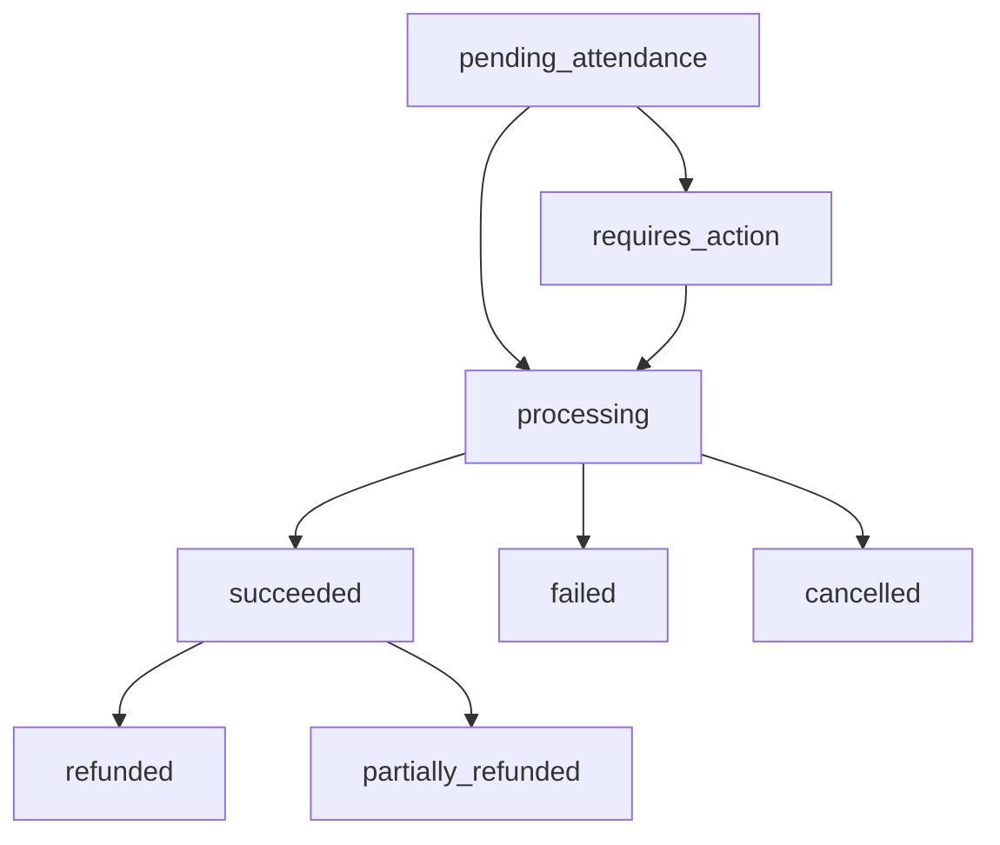

# Payments Canonical Flow

**Document Purpose**: Defines the **one canonical payments flow** for Tithi, covering both owner attendance-based charging and public checkout scenarios.

**Version**: 1.0.0  
**Last Updated**: January 27, 2025  
**Status**: Finalized

---

## Overview

Tithi implements a **single, canonical payments flow** that handles both:
1. **Owner Attendance-Based Charging**: Payment processed after service completion
2. **Public Checkout**: Payment processed at booking time

This document defines the authoritative payment processing path that all frontend implementations must follow.

---

## Core Payment Principles

### 1. Attendance-Based Charging Model

**Primary Flow**: Customers are charged **after** they attend their appointment, not at booking time.

```typescript
// Payment timing
Booking Created → Service Provided → Attendance Marked → Payment Charged
```

### 2. Payment Method Storage

**Card-on-File**: Customer payment methods are securely stored with Stripe for future charges.

### 3. No-Show Policy

**Cancellation Fees**: Customers may be charged a percentage of the service cost for no-shows, as defined by the business.

---

## Canonical Payment Flow

### Phase 1: Booking Creation (No Immediate Charge)

```typescript
// 1. Create booking without payment
POST /api/v1/bookings
{
  "customer_id": "customer_123",
  "service_id": "service_456",
  "resource_id": "resource_789",
  "start_at": "2025-01-28T14:00:00Z",
  "end_at": "2025-01-28T15:00:00Z",
  "idempotency_key": "booking_abc123"
}

// Response: Booking created, no payment required yet
{
  "data": {
    "booking": {
      "id": "booking_123",
      "status": "confirmed",
      "payment_required": false,
      "payment_status": "pending_attendance"
    }
  }
}
```

### Phase 2: Payment Method Setup (Optional)

```typescript
// 2. Setup payment method for future charges (optional)
POST /api/payments/setup-intent
{
  "customer_id": "customer_123",
  "idempotency_key": "setup_abc123"
}

// Response: Setup intent for card-on-file
{
  "data": {
    "setup_intent_id": "seti_abc123",
    "client_secret": "seti_abc123_secret_xyz",
    "status": "requires_action"
  }
}
```

### Phase 3: Attendance-Based Payment Processing

```typescript
// 3. Process payment after attendance (owner action)
POST /api/payments/process
{
  "booking_id": "booking_123",
  "attendance_status": "attended", // or "no_show"
  "idempotency_key": "payment_abc123"
}

// Response: Payment processed
{
  "data": {
    "payment_id": "payment_123",
    "status": "succeeded",
    "amount_cents": 7500, // $75.00
    "currency_code": "USD",
    "receipt_url": "https://pay.stripe.com/receipts/...",
    "attendance_status": "attended"
  }
}
```

---

## Alternative: Public Checkout Flow

For businesses that require payment at booking time:

### Phase 1: Create Payment Intent

```typescript
// 1. Create payment intent for immediate charge
POST /api/payments/intent
{
  "booking_id": "booking_123",
  "amount_cents": 7500,
  "currency_code": "USD",
  "customer_id": "customer_123",
  "idempotency_key": "intent_abc123"
}

// Response: Payment intent for immediate processing
{
  "data": {
    "payment_intent_id": "pi_abc123",
    "client_secret": "pi_abc123_secret_xyz",
    "amount_cents": 7500,
    "currency_code": "USD",
    "status": "requires_action"
  }
}
```

### Phase 2: Confirm Payment

```typescript
// 2. Confirm payment with Stripe
POST /api/payments/confirm
{
  "payment_intent_id": "pi_abc123",
  "payment_method_id": "pm_abc123",
  "idempotency_key": "confirm_abc123"
}

// Response: Payment confirmed
{
  "data": {
    "payment_id": "payment_123",
    "status": "succeeded",
    "amount_cents": 7500,
    "currency_code": "USD",
    "receipt_url": "https://pay.stripe.com/receipts/..."
  }
}
```

---

## Payment Status Lifecycle

### Standard Status Flow

```typescript
type PaymentStatus = 
  | 'pending_attendance'    // Booking created, awaiting service
  | 'requires_action'       // Payment method needs confirmation
  | 'processing'           // Payment being processed
  | 'succeeded'            // Payment completed successfully
  | 'failed'               // Payment failed
  | 'cancelled'            // Payment cancelled
  | 'refunded'             // Payment refunded
  | 'partially_refunded';  // Partial refund issued
```

### Status Transitions



---

## Payment Method Management

### Supported Payment Methods

```typescript
type PaymentMethodType = 
  | 'card'           // Credit/debit cards
  | 'apple_pay'      // Apple Pay
  | 'google_pay'     // Google Pay
  | 'paypal'         // PayPal (future)
  | 'cash'           // Cash payment (no card required)
  | 'card_on_file';  // Previously stored payment method
```

### Payment Method Storage

```typescript
// Store payment method for future use
POST /api/payments/methods
{
  "customer_id": "customer_123",
  "payment_method_id": "pm_abc123",
  "is_default": true,
  "idempotency_key": "method_abc123"
}

// Response: Payment method stored
{
  "data": {
    "payment_method_id": "pm_abc123",
    "type": "card",
    "last_four": "4242",
    "brand": "visa",
    "exp_month": 12,
    "exp_year": 2025,
    "is_default": true
  }
}
```

---

## No-Show and Cancellation Policies

### No-Show Fee Processing

```typescript
// Process no-show fee
POST /api/payments/process
{
  "booking_id": "booking_123",
  "attendance_status": "no_show",
  "fee_percentage": 50, // 50% of service cost
  "idempotency_key": "noshow_abc123"
}

// Response: No-show fee charged
{
  "data": {
    "payment_id": "payment_123",
    "status": "succeeded",
    "amount_cents": 3750, // 50% of $75.00
    "currency_code": "USD",
    "attendance_status": "no_show",
    "fee_type": "no_show_fee"
  }
}
```

### Cancellation Policy

```typescript
interface CancellationPolicy {
  free_cancellation_hours: number; // Hours before service for free cancellation
  cancellation_fee_percentage: number; // Percentage charged for late cancellation
  no_show_fee_percentage: number; // Percentage charged for no-show
}
```

---

## Refund Processing

### Full Refund

```typescript
// Process full refund
POST /api/payments/refund
{
  "payment_id": "payment_123",
  "amount_cents": 7500, // Full amount
  "reason": "customer_request",
  "idempotency_key": "refund_abc123"
}

// Response: Refund processed
{
  "data": {
    "refund_id": "refund_123",
    "payment_id": "payment_123",
    "amount_cents": 7500,
    "status": "succeeded",
    "reason": "customer_request"
  }
}
```

### Partial Refund

```typescript
// Process partial refund
POST /api/payments/refund
{
  "payment_id": "payment_123",
  "amount_cents": 3750, // Partial amount
  "reason": "service_issue",
  "idempotency_key": "partial_refund_abc123"
}
```

---

## Webhook Processing

### Stripe Webhook Events

```typescript
// Webhook event processing
interface WebhookEvent {
  id: string;
  type: string;
  data: {
    object: any;
  };
  created: number;
}

// Key webhook events handled:
const WEBHOOK_EVENTS = [
  'payment_intent.succeeded',
  'payment_intent.payment_failed',
  'payment_method.attached',
  'charge.dispute.created',
  'invoice.payment_succeeded',
  'invoice.payment_failed'
];
```

### Webhook Processing Flow

```typescript
// 1. Receive webhook from Stripe
POST /api/webhooks/stripe
{
  "id": "evt_abc123",
  "type": "payment_intent.succeeded",
  "data": {
    "object": {
      "id": "pi_abc123",
      "status": "succeeded",
      "amount": 7500
    }
  }
}

// 2. Process webhook (idempotent)
// - Update payment status
// - Send confirmation email
// - Update booking status
// - Log audit trail
```

---

## Error Handling

### Payment Error Types

```typescript
interface PaymentError {
  type: 'payment_error';
  title: string;
  status: number;
  detail: string;
  error_code: string;
  payment_intent_id?: string;
  decline_code?: string;
  retry_after?: number;
}

// Common payment error codes
const PAYMENT_ERROR_CODES = {
  CARD_DECLINED: 'card_declined',
  INSUFFICIENT_FUNDS: 'insufficient_funds',
  EXPIRED_CARD: 'expired_card',
  INVALID_CVC: 'invalid_cvc',
  PROCESSING_ERROR: 'processing_error',
  NETWORK_ERROR: 'network_error'
};
```

### Error Recovery

```typescript
// Retry strategy for failed payments
const RETRY_STRATEGY = {
  max_retries: 3,
  backoff_multiplier: 2,
  initial_delay_ms: 1000,
  max_delay_ms: 10000
};

// Error recovery flow
async function retryPayment(paymentIntentId: string, attempt: number = 1) {
  try {
    const result = await stripe.paymentIntents.confirm(paymentIntentId);
    return result;
  } catch (error) {
    if (attempt < RETRY_STRATEGY.max_retries && isRetryableError(error)) {
      const delay = Math.min(
        RETRY_STRATEGY.initial_delay_ms * Math.pow(RETRY_STRATEGY.backoff_multiplier, attempt - 1),
        RETRY_STRATEGY.max_delay_ms
      );
      await new Promise(resolve => setTimeout(resolve, delay));
      return retryPayment(paymentIntentId, attempt + 1);
    }
    throw error;
  }
}
```

---

## Security and Compliance

### PCI Compliance

```typescript
// PCI compliance requirements
const PCI_REQUIREMENTS = {
  // Never store raw card data
  no_raw_card_data: true,
  
  // Use Stripe Elements for card input
  use_stripe_elements: true,
  
  // Encrypt sensitive data in transit
  tls_required: true,
  
  // Audit all payment operations
  audit_logging: true,
  
  // Implement proper access controls
  access_controls: true
};
```

### Data Protection

```typescript
// Sensitive data handling
interface PaymentDataProtection {
  // Mask card numbers in logs
  mask_card_numbers: true;
  
  // Encrypt payment method references
  encrypt_payment_methods: true;
  
  // Implement data retention policies
  data_retention_days: 2555; // 7 years for compliance
  
  // Anonymize customer data on request
  anonymize_on_request: true;
}
```

---

## Frontend Integration

### Stripe Elements Integration

```typescript
// Frontend payment form
import { loadStripe } from '@stripe/stripe-js';
import { Elements, CardElement } from '@stripe/react-stripe-js';

const stripePromise = loadStripe(process.env.REACT_APP_STRIPE_PUBLISHABLE_KEY!);

function PaymentForm({ bookingId, amount }: { bookingId: string; amount: number }) {
  const handleSubmit = async (event: React.FormEvent) => {
    event.preventDefault();
    
    // Create payment intent
    const { data: intent } = await apiClient.post('/api/payments/intent', {
      booking_id: bookingId,
      amount_cents: amount,
      currency_code: 'USD',
      idempotency_key: generateIdempotencyKey()
    });
    
    // Confirm payment with Stripe
    const stripe = await stripePromise;
    const { error } = await stripe!.confirmCardPayment(
      intent.client_secret,
      {
        payment_method: {
          card: cardElement,
          billing_details: {
            name: customerName,
            email: customerEmail
          }
        }
      }
    );
    
    if (error) {
      // Handle payment error
      console.error('Payment failed:', error);
    } else {
      // Payment succeeded
      console.log('Payment succeeded');
    }
  };
  
  return (
    <Elements stripe={stripePromise}>
      <form onSubmit={handleSubmit}>
        <CardElement />
        <button type="submit">Pay ${amount / 100}</button>
      </form>
    </Elements>
  );
}
```

### Payment Status Tracking

```typescript
// Payment status polling
const usePaymentStatus = (paymentIntentId: string) => {
  const [status, setStatus] = useState<PaymentStatus>('processing');
  
  useEffect(() => {
    const pollStatus = async () => {
      try {
        const response = await apiClient.get(`/api/payments/${paymentIntentId}`);
        setStatus(response.data.status);
        
        if (response.data.status === 'succeeded' || response.data.status === 'failed') {
          return; // Stop polling
        }
        
        // Continue polling
        setTimeout(pollStatus, 2000);
      } catch (error) {
        console.error('Error polling payment status:', error);
      }
    };
    
    pollStatus();
  }, [paymentIntentId]);
  
  return status;
};
```

---

## Testing

### Payment Flow Tests

```typescript
describe('Canonical Payment Flow', () => {
  it('should process attendance-based payment', async () => {
    // 1. Create booking
    const booking = await createBooking({
      customer_id: 'customer_123',
      service_id: 'service_456',
      start_at: '2025-01-28T14:00:00Z'
    });
    
    // 2. Mark attendance
    const payment = await processPayment({
      booking_id: booking.id,
      attendance_status: 'attended'
    });
    
    expect(payment.status).toBe('succeeded');
    expect(payment.amount_cents).toBe(7500);
  });
  
  it('should handle no-show fee', async () => {
    const booking = await createBooking({...});
    
    const payment = await processPayment({
      booking_id: booking.id,
      attendance_status: 'no_show'
    });
    
    expect(payment.status).toBe('succeeded');
    expect(payment.amount_cents).toBe(3750); // 50% fee
  });
  
  it('should process immediate payment', async () => {
    // 1. Create payment intent
    const intent = await createPaymentIntent({
      booking_id: 'booking_123',
      amount_cents: 7500
    });
    
    // 2. Confirm payment
    const payment = await confirmPayment({
      payment_intent_id: intent.payment_intent_id,
      payment_method_id: 'pm_abc123'
    });
    
    expect(payment.status).toBe('succeeded');
  });
});
```

---

## Monitoring and Observability

### Payment Metrics

```typescript
// Key payment metrics to track
const PAYMENT_METRICS = {
  success_rate: 'percentage of successful payments',
  average_processing_time: 'time from intent to completion',
  failure_rate_by_reason: 'breakdown of failure reasons',
  refund_rate: 'percentage of payments refunded',
  no_show_rate: 'percentage of no-shows',
  chargeback_rate: 'percentage of chargebacks'
};
```

### Audit Logging

```typescript
// Payment audit events
const PAYMENT_AUDIT_EVENTS = [
  'payment_intent_created',
  'payment_intent_confirmed',
  'payment_succeeded',
  'payment_failed',
  'refund_processed',
  'chargeback_received',
  'dispute_created'
];

// Audit log entry
interface PaymentAuditLog {
  event_type: string;
  payment_id: string;
  booking_id: string;
  customer_id: string;
  amount_cents: number;
  currency_code: string;
  status: string;
  timestamp: string;
  user_id?: string;
  ip_address: string;
  user_agent: string;
}
```

---

## Migration Guide

### From Legacy Payment System

If migrating from a different payment system:

```typescript
// Legacy payment data migration
interface LegacyPayment {
  id: string;
  amount: number;
  currency: string;
  status: string;
  created_at: string;
}

// Migration to canonical format
const migratePayment = (legacy: LegacyPayment): Payment => {
  return {
    id: legacy.id,
    amount_cents: Math.round(legacy.amount * 100), // Convert to cents
    currency_code: legacy.currency.toUpperCase(),
    status: mapLegacyStatus(legacy.status),
    created_at: legacy.created_at
  };
};
```

---

## Completion Criteria

This document is **complete** when:
- ✅ Single canonical payment flow is defined
- ✅ Both attendance-based and immediate payment flows are documented
- ✅ Error handling and recovery strategies are specified
- ✅ Security and compliance requirements are outlined
- ✅ Frontend integration examples are provided
- ✅ Testing and monitoring strategies are documented

**Status**: ✅ COMPLETE - Canonical payment flow finalized

---

**Event**: `payments_canonical_flow_published` - Emitted when canonical payment flow is finalized
